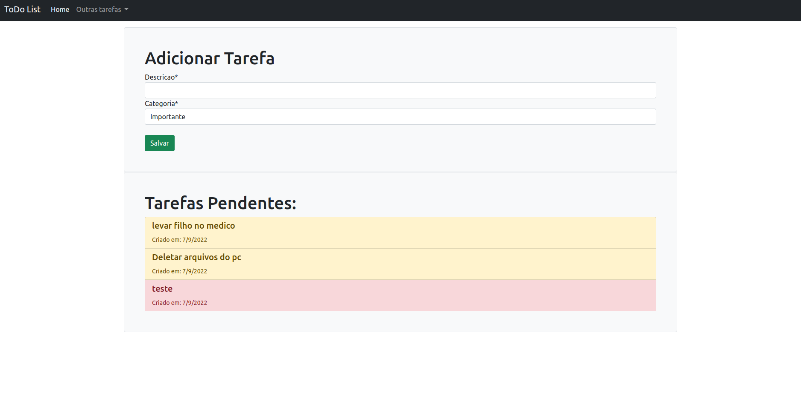
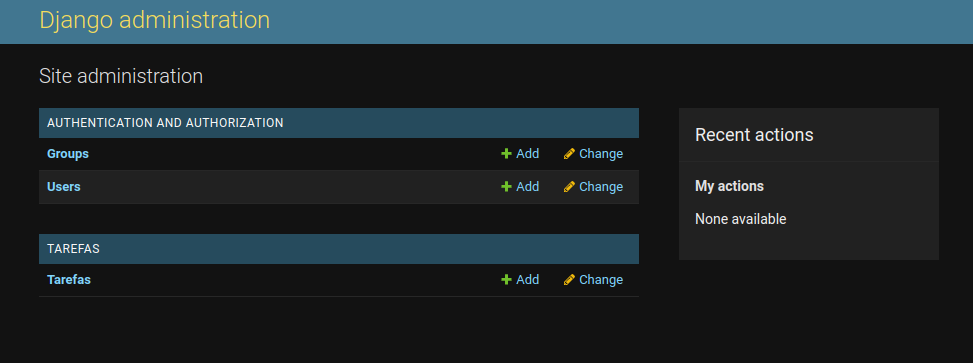
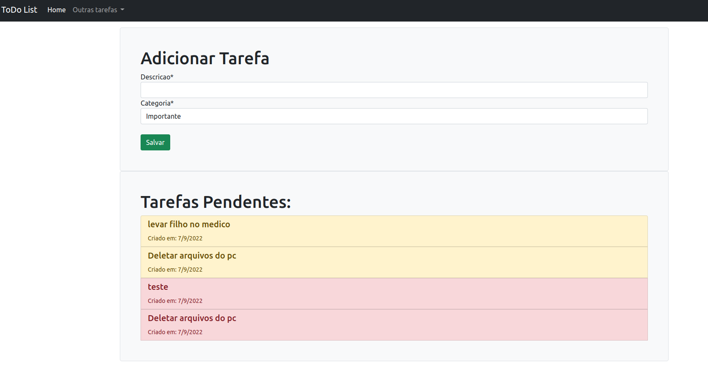

# Desafio Técnico - DTI Digital

<!---Esses são exemplos. Veja https://shields.io para outras pessoas ou para personalizar este conjunto de escudos. Você pode querer incluir dependências, status do projeto e informações de licença aqui--->




> ToDo List completo com adiamento,pendentes,cancelamentos e afins.

### Ajustes e melhorias

O projeto ainda está em desenvolvimento e as próximas atualizações serão voltadas nas seguintes tarefas:

- [x] Implementar a funcionalidade do botão do exclusão de tarefas
- [x] Implementar a funcionalidade do botão de adiamento de tarefas
- [x] Implementar a funcionalidade de edição de tarefas
- [x] Visualizando tarefas concluídas
- [x] Visualizando tarefas adiadas

## 💻 Pré-requisitos

Antes de começar, verifique se você atendeu aos seguintes requisitos:
<!---Estes são apenas requisitos de exemplo. Adicionar, duplicar ou remover conforme necessário--->
* Você instalou a versão mais recente de `Python 3.10 / Django `
* Você tem uma máquina `Windows / Linux / Mac`.
* Guia de instalacao do Python `Guia / https://www.python.org/downloads/`.
* Guia de instalacao do Django `Guia / https://docs.djangoproject.com/en/4.1/topics/install/`.

## 🚀 Instalando ToDoList

Para instalar o ToDoList, siga estas etapas:

Instalando o Django (Linux e macOS):
```
    pip install django
```


Aplicando migrations
```
   python manage.py migrate
```

Criar um superuser
```
  python manage.py createsuperuser
```

Iniciar o servidor  (Ao iniciar o servidor retorna a URL de acesso)
```
   python manage.py runserver
```

 Acessando localhost /admin  tera o acesso administrativo do Django.
```
    Exemplo:  http://127.0.0.1:8000/admin/
```


 Acessando localhost /tarefas  tera ao app.
```
    Exemplo:  http://127.0.0.1:8000/tarefas/
```


[⬆ Voltar ao topo](#nome-do-projeto)<br>
